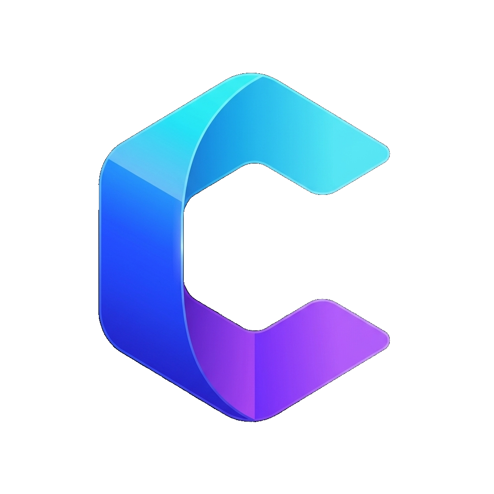
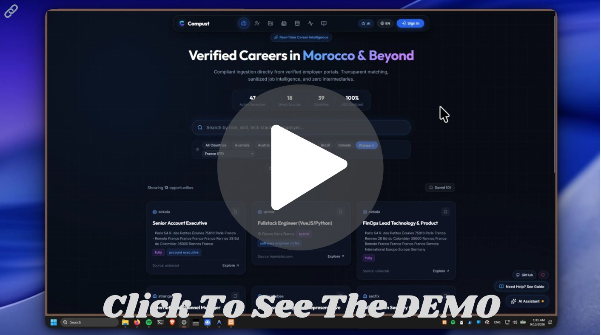
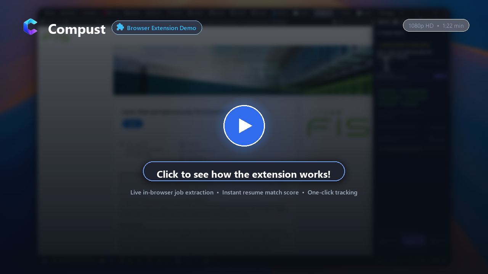
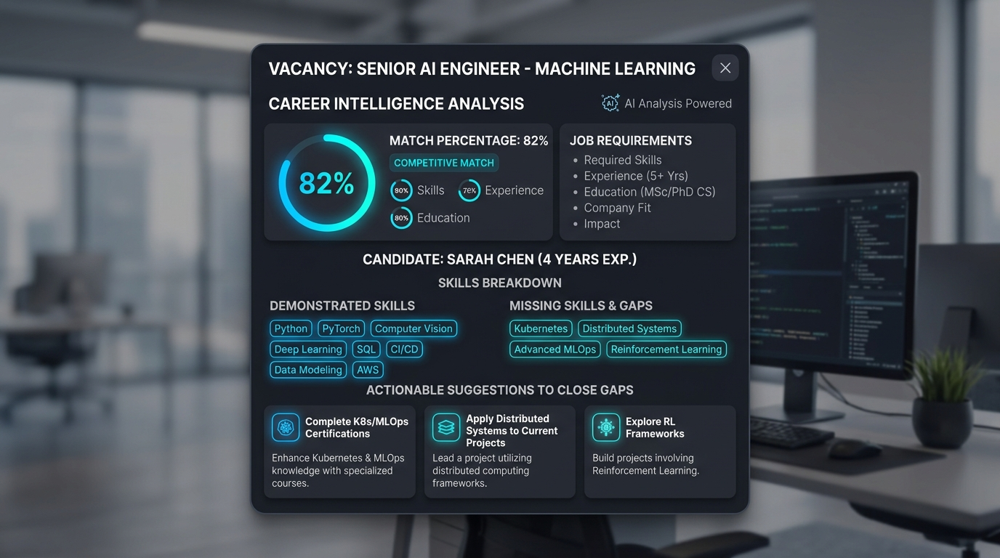
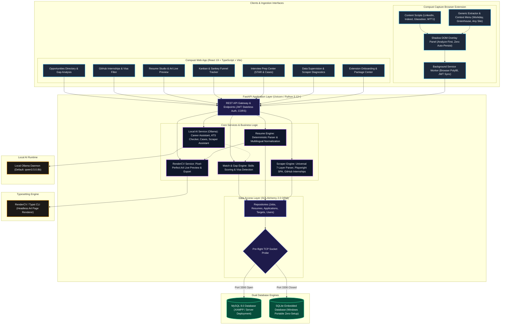

<p align="center">
  
</p>

<h1 align="center">Compust</h1>

<p align="center">
  <em>Local-First Career Intelligence & Verified Vacancy Directory</em>
</p>

<p align="center">
  <a href="https://drive.google.com/file/d/1V1UkAwfKErwvKLdZK2VN0cH_suhf8MGZ/view?usp=sharing">
    <strong>🎥 Google Drive Video Demo</strong>
  </a>
</p>

<p align="center">
  <a href="https://drive.google.com/file/d/1V1UkAwfKErwvKLdZK2VN0cH_suhf8MGZ/view?usp=sharing">
    
  </a>
</p>

<a id="compust-capture-demo"></a>
### 🧩 Browser Extension Demo

*Watch how Compust Capture extracts job postings in real time, computes instant resume alignment, and routes vacancies directly to your tracking board:*

[](https://drive.google.com/file/d/1KRz11E0OOpLJNTWerkFmbSLtkoqL0dua/view?usp=sharing)

<p align="center">
  <em>↗ Opens an external demo video hosted on Google Drive.</em>
</p>

<p align="center">
  <strong>A high-transparency employment intelligence platform combining automated multi-source career portal ingestion, deterministic resume parsing, vacancy match scoring, omnipresent browser job capture, and interactive gap analysis.</strong>
</p>

<p align="center">
  <a href="#overview">Overview</a> •
  <a href="#key-features">Key Features</a> •
  <a href="#compust-capture-demo">Extension Demo</a> •
  <a href="#system-architecture">Architecture</a> •
  <a href="#quick-start-guide">Quick Start</a> •
  <a href="#testing--verification">Testing</a> •
  <a href="#api-examples">API Examples</a> •
  <a href="#future-roadmap">Future Roadmap</a>
</p>

---

## Overview

**Compust** is an end-to-end career intelligence and job discovery platform built for transparency, accuracy, and performance. Unlike traditional job aggregators that suffer from stale listings, broken links, or generic indexing, Compust connects directly to verified employer career portals (Workday, SmartRecruiters, Greenhouse, Ashby, Workable, Lever, Teamtailor, custom career sites), ingests curated internships from community repositories, and empowers candidates to capture vacancies anywhere across the web through the **Compust Capture** browser extension.

> [!IMPORTANT]
> ### Please Read Before Using Compust
> - **What Compust IS:** A companion career discovery and intelligence tool that helps users ingest and centralize vacancies directly from verified employer portals, evaluate transparent match scores, manage resumes, and track recruitment pipelines.
> - **What Compust IS NOT:** Compust is **NOT** a full replacement for LinkedIn, Indeed, Glassdoor, professional recruiters, or company career boards. Compust does not contain every job on the internet.
> - **Why Some Jobs May Be Missing:** Whether an opening appears in Compust depends on whether its source portal can be accessed, detected, parsed, and normalized. **Not seeing a job in Compust does NOT mean the company does not have that opening available.** Always check company career portals directly.
> - **Project Limitations:** Some sites enforce Cloudflare WAF bot-protection (Compust respects robots.txt and does not bypass WAF/CAPTCHAs), client-rendered SPA shells (hydrated via our Playwright fallback), or multi-tier infinite-scroll pagination.
> - **In-App Interactive Guide:** For an interactive walkthrough, live architecture diagrams, and testing guides, open the **Guide & Docs** tab directly inside the Compust application or click the persistent **"Need Help? See Guide"** button.

In addition to job discovery, Compust provides a **Career Intelligence & Resume Match Engine**:
- Candidates upload their resumes in standard PDF format.
- Compust extracts text layers deterministically without lossy OCR and profiles key technical competencies across multiple languages (English, French, German).
- When inspecting any vacancy or capturing an external listing, candidates receive an instant **Requirements Match Analysis**, showing demonstrated skills, missing requirements, ATS compatibility advice, visa/work-authorization screenings, and targeted section enhancements.

---

## Key Features

### 1. Verified Career Opportunities Directory
- Real-time catalog of curated vacancies across Morocco and international tech hubs.
- Deep filtering by keyword, location, work mode (Remote, Hybrid, On-site), department, contract type, and salary.
- Multi-lingual user interface with instantaneous **English (EN), French (FR), and Dutch (NL)** locale toggles via a unified top-navigation language switcher.

### 2. Compust Capture Browser Extension (Chrome, Edge, Brave & Firefox)
- **Omnipresent Job Capture**: Ingest opportunities directly while browsing without leaving external job portals. *(Watch the [Browser Extension Demo](#compust-capture-demo) walkthrough above).*
- **Native Platform Adapters**: Instant auto-detection and extraction on **LinkedIn, Indeed, Glassdoor, and Welcome to the Jungle**.
- **Universal Context Menu & Generic Extractor**: Right-click anywhere on arbitrary career portals (Workday, Greenhouse, Ashby, Lever, company career pages) to extract vacancy metadata from semantic HTML cards and embedded JSON-LD.
- **Analyze-First Ephemeral Flow**: Activating capture triggers an in-page, isolated Shadow DOM panel that performs an instant, ephemeral match analysis against your active resume (match score, demonstrated vs. missing skills, visa requirements, tailored suggestions) with **zero auto-persistence** — positions are only stored when explicitly clicked (`Add to Directory`, `Mark Applied`, `Save`, or `Skip`).
- **In-App Onboarding & Package Download**: Dedicated `/extension` onboarding view inside Compust featuring automatic browser detection, one-click zip package downloads, and step-by-step installation guides.
- **Firefox AMO Submission Status**: The Firefox extension package has been submitted to Mozilla's official add-ons store (**addons.mozilla.org / AMO**) and is **currently awaiting review** (will be linked once approved). In the meantime, users can install it immediately via the in-app manual build / "Load Temporary Add-on" developer flow.

### 3. GitHub Tech & Engineering Internships Hub
- **Direct GitHub Repository Ingestion**: Aggregates live summer and off-cycle tech, software engineering, AI/ML, quantitative finance, and hardware internships synchronized from community-curated GitHub repositories (SimplifyJobs, Zapply, Vansh/Ouckah, Negar Canadian).
- **Multi-Repository Synchronization**: Fast caching with automated repository synchronization, category classification, and direct application links.
- **Deep Analysis & Visa / Work Authorization Screening**: Explicit status badges (**Visa Sponsored**, **No Sponsorship / 🛂**, **US Citizens / Clearance / 🇺🇸**, **Canada Eligible / 🇨🇦**) with deep filtering to immediately protect candidates from ineligible applications.

### 4. Resume Parsing & Candidate Profiling
- **Zero-OCR Deterministic Text Extraction**: Native PDF text extraction ensuring 100% fidelity without hallucination.
- **Multilingual Recognition (EN / FR / DE)**: Enhanced deterministic parsing detecting section headers, work history, education, competencies, and spoken languages across French, German, and English.
- **Clean Keyword-Only Skill Model**: Removed arbitrary skill proficiency bars (beginner/expert) in accordance with modern recruitment standards — skills are indexed as discrete, verifiable competency tokens. Spoken languages retain clear CEFR / proficiency designations.
- **Preserved Original vs. Editable Copy Architecture**: Uploaded master PDF resumes remain immutable and safely preserved. Any editing, tailoring, or ATS enhancement forks into an editable, structured studio copy (`source_resume_id`).

### 5. WYSIWYG Resume Studio & RenderCV Typesetting Engine
- **RenderCV & Typst Engine Overhaul**: Powered by RenderCV, generating pixel-perfect, ATS-compliant documents typeset via Typst.
- **A4 Page-Accurate Live Preview**: Renders high-resolution per-page previews with zero layout drift or pagination mismatch between the editor and exported documents.
- **6-Pillar ATS Checker**: Built-in comprehensive ATS evaluation modal grading resumes across 6 core criteria (Parseability, Keywords, Section Standardization, Quantifiable Impact & Action Verbs, Formatting & Length Conventions, Contact Detectability). Delivers 0–100 category scores, grounded quotes from your resume, missing keywords, and recommended action verbs powered by local Ollama LLM with resilient deterministic fallback.
- **Targeted Application Materials**: Generates role-specific Cold Emails, LinkedIn/WhatsApp outreach messages, and structured Cover Letters with one-click export to PDF and DOCX.

<p align="center">
  
</p>

> [!TIP]
> ### 🤖 Job-Specific Resume & Career Assistant (Local LLM via Ollama)
> Compust features a fully local, privacy-first **Career Assistant & Job Targeting Engine** built into the Resume Builder:
> - **100% Local Inference**: Operates strictly through local Ollama (`qwen3.5:0.8b` or user-configured model) without transmitting candidate or vacancy data to any external cloud API.
> - **Anti-Hallucination Safeguards**: Recommendations and evidence links are strictly grounded in candidate data. Missing requirements are flagged as *"Not found in your Compust data"* and are never hallucinated into candidate experience.
> - **Master Resume Protection**: Master resumes are never silently modified. Accepted recommendations produce a dedicated tailored copy (`source_resume_id`) or can be previewed live in the WYSIWYG editor draft.
> - **Deterministic Explainable Scoring**: Reproducible 0–10 category scores (Technical, Experience, Education, Languages, ATS) computed by deterministic logic rather than arbitrary LLM ratings.
> - **Multilingual Generation**: Native support for **English, French, German, and Spanish** recruitment terminology.
> - **Resilient Fallback**: If Ollama is unavailable or times out, deterministic keyword and overlap analysis immediately executes so the candidate is never blocked.

### 6. Gap Analysis & Career Recommendations
- **Demonstrated Skills vs. Missing Requirements**: Visual pill chips highlight what is already proven in your resume versus requirements you still need to highlight.
- **Visa & Work Authorization Detection**: Automatically flags visa sponsorship restrictions, citizenship prerequisites, and security clearance notes.
- **ATS Compatibility Advice**: Automated formatting checks to maximize ATS parsing efficiency.
- **Section Enhancements**: Practical advice for tailoring work experience bullets and summary statements.
- **Existing Document Downloads**: One-click export for tailored resumes in both PDF and Word DOCX formats.

### 7. Interactive Applications Kanban & Sankey Pipeline Tracker
- Built-in tracking board with fluid drag-and-drop workflow: `Applied` ➔ `Interviewing` ➔ `Offer` ➔ `Rejected`.
- **Live Sankey Funnel Chart**: Dynamic visual application funnel modeled after SankeyMATIC with real-time conversion metrics.
- **Spreadsheet UX**: Excel-style table view with inline editing, batch operations, notes, salary expectations, and one-click XLSX export.

### 8. Dedicated Technical & Behavioral Interview Prep Center
- **Multilingual Behavioral Prep**: Comprehensive STAR method (Situation, Task, Action, Result) interview coaching across 4 languages (**English, French, German, Spanish**).
- **Curated Domain Tracks**: Dedicated curriculum for **Data Engineering**, **Cybersecurity & Network Defense**, **AI & Machine Learning Engineering**, and **Frontend & Web Engineering**.
- **"Explain with AI" Narrative Case Scenarios**: Intelligent deep-dive generator that illustrates concepts through multi-step narrative case scenarios with named actors (e.g., Alice and Bob navigating spear-phishing attack vectors, or distributed stream architectures), trade-off breakdowns, and interview talking points.
- **Source Preservation**: Complete attribution and direct links to upstream open-source curriculum repositories.

### 9. Data Supervision & LLM-Assisted Scraper Diagnostics
- **Supervision Hub**: Administrative monitoring of scrape targets, ingestion runs, candidate items, and deduplication statistics.
- **Interactive Scraper Test Diagnostic**: Test any portal URL on demand (`POST /api/v1/admin/scraper/test`) with detailed telemetry: crawl strategy, detected platform, content signal markers, and discrepancy alerts (e.g. DOM cards found vs parser filters).
- **LLM Scraper Assistant**: Local AI explains parsing anomalies, identifies technical root causes (e.g. dynamic class changes, anti-bot challenges, non-standard layout), and provides one-click corrective workflows (`Keep Accepted Only` vs `Force-Integrate All`).

### 10. Windows Standalone Portable Release (Zero Setup)
- **Single-Click Launch (`Compust.bat`)**: Ready to run for non-technical users without requiring Python, Node.js, npm, MySQL, XAMPP, or Git.
- **Automated SQLite Fallback**: If MySQL is not running on port 3306, Compust seamlessly initializes a standalone local SQLite database with an empty, ready-to-use schema.
- **Embedded SPA Serving**: FastAPI natively serves the production-compiled React application on port 8000 when Node/npm is not detected.
- **Desktop Shortcut Creator (`setup_shortcut.bat`)**: Generates an official desktop shortcut with icon and automatic port-checking launch sequence.

### 11. Ethical Career Scraper Hub
- **Robots.txt Enforced**: Automatic verification against site crawling rules before initiating scrape runs.
- **Deduplication Engine**: Unique hashing on company and external identifiers prevents duplicate listings.
- **Platform Adapters**: Dedicated parsers for corporate portals (Capgemini, Orange, Inwi, Deloitte, etc.) and generic universal heuristics for new sites.
- **Rate-Limiting & Cooldown**: Domain-aware back-off logic prevents target server overload.
- **Playwright Fallback**: Automated headless browser rendering for complex single-page applications (SPAs).

---

## System Architecture

Compust is built with clean layer separation, dual-mode database resilience, local-first AI, and modern web standards:



- **Backend**: Python 3.12+ (tested on Python 3.14) with FastAPI, Pydantic v2, SQLAlchemy 2.0, Alembic, and Bleach sanitization.
- **Frontend**: React 19, TypeScript, Vite, Styled Components, and Lucide React.
- **Browser Extension**: Manifest V3 (Chromium) & Manifest V2/V3 (Firefox) with `webextension-polyfill`, isolated Shadow DOM overlay, and secure HTTP communication with the backend.
- **Resume Rendering Pipeline**: RenderCV with Typst compiler invoked in a subprocess to produce pixel-perfect A4 live previews and ATS-formatted PDF exports.
- **Local AI Engine**: Local Ollama runtime (`qwen3.5:0.8b`) powering the Career Assistant, 6-Pillar ATS Checker, Interview Prep Scenarios, and Scraper Diagnostics, backed by deterministic heuristic fallbacks.
- **Database Resilience**: Automatic dual-engine support — MySQL 8.0+ when port 3306 is open, with automatic fallback to isolated SQLite (`important/data/compust_local.db`). In-memory SQLite for lightning-fast pytest execution.
- **Developer Guide**: For complete, machine-friendly architectural specifications and LLM safety rules, see [COMPUS_DEVELOPER_GUIDE.md](COMPUS_DEVELOPER_GUIDE.md).

---

## Quick Start Guide

Follow these steps to run Compust locally on your machine.

### Prerequisites
- **Python**: 3.12+ (Python 3.14 supported)
- **Node.js**: 20.0+ and `npm` 10.0+
- **Database**: MySQL 8.0+ (e.g. through **XAMPP** or standalone MySQL Server; optional if using SQLite standalone mode)

---

### Step 1: Start the Database (XAMPP / MySQL)

1. Open the **XAMPP Control Panel**.
2. Click **Start** next to the **MySQL** module (default port `3306`).
3. Open phpMyAdmin (`http://localhost/phpmyadmin`) or run the MySQL command line, and create the database:
   ```sql
   CREATE DATABASE compust CHARACTER SET utf8mb4 COLLATE utf8mb4_unicode_ci;
   ```

*(Note: If MySQL is not running on port 3306, Compust automatically falls back to an embedded SQLite database.)*

---

### Step 2: Backend Setup & Virtual Environment

Open a terminal (PowerShell on Windows, or Bash on macOS/Linux) and navigate to the `important/` directory:

```powershell
# Navigate to backend directory
cd important

# 1. Create a Python virtual environment
python -m venv .venv

# 2. Activate the virtual environment
# Windows (PowerShell):
.\.venv\Scripts\Activate.ps1
# Windows (CMD):
.\.venv\Scripts\activate.bat
# Linux / macOS:
source .venv/bin/activate

# 3. Upgrade pip and install all required dependencies
pip install --upgrade pip
pip install -r requirements.txt
```

#### Configure Environment Variables
Create or verify the `.env` file in the `important/` directory:

```env
COMPUST_DATABASE_URL=mysql+pymysql://root:@localhost:3306/compust
COMPUST_SECRET_KEY=your-secure-random-secret-key-at-least-32-chars
COMPUST_ENVIRONMENT=development
COMPUST_CORS_ALLOWED_ORIGINS=http://localhost:5173,http://127.0.0.1:5173,http://localhost:4173
```

#### Run Database Migrations
Run the SQL migration runner to set up all tables:

```powershell
# Apply all schema migrations
python -m migrations.runner

# (Optional) Verify Alembic head state
alembic upgrade head
```

#### Start the FastAPI Server
Launch the backend server with auto-reloading enabled:

```powershell
uvicorn src.app.main:app --reload --port 8000
```

- **Backend API**: `http://localhost:8000`
- **Interactive Swagger Documentation**: `http://localhost:8000/docs`
- **ReDoc Documentation**: `http://localhost:8000/redoc`
- **Health Check**: `http://localhost:8000/health`

---

### Step 3: Frontend Setup (React + Vite)

Open a **second terminal window** and navigate to the frontend directory:

```powershell
# Navigate to frontend directory
cd important/frontend

# 1. Install Node dependencies
npm install

# 2. Start the local development server
npm run dev
```

The Vite dev server will launch at:
- **Application URL**: `http://localhost:5173/`

---

### Step 4: Compust Capture Browser Extension Setup

To install the browser extension locally:

1. **Via In-App Onboarding**: Navigate to `http://localhost:5173/extension` (or click **Extension** in the navigation bar) to download pre-built packages for your browser with interactive setup instructions.
2. **Manual Build**:
   ```bash
   cd important/extension
   npm ci
   # For Chrome / Edge / Brave:
   npm run build:chrome
   # For Firefox:
   npm run build:firefox
   ```
3. **Load in Browser**:
   - **Chrome / Edge / Brave**: Open `chrome://extensions/`, enable **Developer mode**, click **Load unpacked**, and select `important/extension/dist/chrome`.
   - **Firefox**: Open `about:debugging#/runtime/this-firefox`, click **Load Temporary Add-on...**, and select `important/extension/dist/firefox/manifest.json`. *(The official package is currently under review at addons.mozilla.org and will be available for direct one-click install upon approval).*

---

### Optional: One-Click Desktop Launcher (Windows)

For a streamlined experience on Windows without having to manually open multiple terminal windows every time:

1. **One-Time Setup**: After completing the initial setup above, run the setup script **once** from the project root:
   - Double-click `setup_shortcut.bat` (or run `python launcher\create_shortcut.py` in your terminal).
   - This automatically generates a desktop shortcut named **Compust** featuring the official logo.
2. **Launching the Platform**: Whenever you want to use Compust, simply **double-click the Compust desktop shortcut** instead of manually opening terminals.
3. **Database Requirement**: Your configured **MySQL/Compust database must already be running on the project's configured database port** (default `3306`), whether running via the **XAMPP Control Panel** or another MySQL installation.
4. **Automated Launch Sequence**: The launcher detects and checks your database connection first, starts both the backend and frontend servers, and opens the application in your default browser.

---

## Scraping & Source Management

Compust includes administrative tools to onboard, inspect, and scrape career portals safely:

```powershell
# In important/ directory with active .venv:

# 1. Onboard a new company career portal
python -m src.app.cli.onboard --name "Acme Corp" --careers-url "https://acme.com/careers" --country "MA"

# 2. Run diagnostics on a registered target
python -m src.app.scraper.diagnostics --target-id 1

# 3. Execute an ingestion run for pending scrape targets
python -m src.app.scraper.crawler --run-pending
```

---

## Testing & Verification

All backend tests run in isolated environments using in-memory SQLite instances so they execute without requiring external connections:

```powershell
# Run backend pytest suite (from important/ directory)
pytest -v

# Run dedicated AI tailoring and extension verification
pytest important/tests/test_extension_quick_add.py -v
pytest important/tests/test_ats_checker.py -v
pytest important/tests/test_github_internships.py -v

# Run code style and linting checks
ruff check src tests
```

To validate the frontend:

```powershell
# From important/frontend/
npm run lint    # Oxlint check
npm run build   # TypeScript compiler + Vite production build
```

To test the browser extension:

```powershell
# From important/extension/
npm test        # Unit tests via Vitest
```

---

## API Examples

### 1. Health Check
```bash
curl http://localhost:8000/health
```
**Response:**
```json
{
  "status": "healthy",
  "environment": "development"
}
```

### 2. Search Vacancies
```bash
curl "http://localhost:8000/api/v1/jobs?search=Python&remote_type=Remote&limit=5"
```

### 3. Ephemeral Job Analysis (Extension / Quick Add)
```bash
curl -X POST "http://localhost:8000/api/v1/jobs/analyze-ephemeral" \
  -H "Content-Type: application/json" \
  -H "Authorization: Bearer <YOUR_JWT_TOKEN>" \
  -d '{
    "title": "Senior Cloud Security Engineer",
    "company": "Acme Corp",
    "url": "https://example.com/job/123",
    "description": "Requires 5+ years with AWS, Kubernetes, Python. US Citizenship required."
  }'
```
**Response:**
```json
{
  "title": "Senior Cloud Security Engineer",
  "company": "Acme Corp",
  "match_score": 82,
  "demonstrated_skills": ["Python", "AWS", "Docker"],
  "missing_skills": ["Kubernetes"],
  "visa_analysis": {
    "mentioned": true,
    "snippet": "US Citizenship required."
  }
}
```

---

## Future Roadmap

The following enhancements are planned for upcoming releases:

- [x] **WYSIWYG Resume Studio & Job Targeting**: Generative vacancy-specific tailoring with live preview and cold outreach generator. *(Delivered in v1.0)*
- [x] **Technical & Behavioral Interview Prep Knowledge Center**: Multilingual STAR preparation and domain curriculum with AI narrative case scenarios. *(Delivered in v1.0)*
- [x] **Standalone Windows Distribution**: Portable release with automatic SQLite fallback requiring zero external runtimes. *(Delivered in v1.0)*
- [x] **Compust Capture Browser Extension**: Omnipresent vacancy capture for Chrome, Edge, Brave, and Firefox with analyze-first ephemeral overlay and generic ATS extraction. *(Delivered)*
- [x] **GitHub Internships Hub & Visa Screening**: Direct repository aggregation with deep work-authorization and visa classification. *(Delivered)*
- [x] **RenderCV Typesetting Overhaul & A4 Live Preview**: Typst-backed layout-drift-free preview, ATS-formatted exports, and 6-pillar ATS Checker. *(Delivered)*
- [x] **Unified App-Wide i18n & Multilingual Parser**: Top-nav locale switcher (EN/FR/NL) and cross-lingual resume parsing across English, French, and German. *(Delivered)*
- [x] **Data Supervision & Scraper AI Diagnostics**: Structured run telemetry, discrepancy alerts, and LLM explanation assistant. *(Delivered)*
- [ ] **Automated Background Scheduler Daemon**: Autonomous background service to schedule recurring company scrapes based on cooldown intervals.
- [ ] **Instant Job Alerts**: Real-time vacancy notifications via WhatsApp and Email based on personalized skill preferences.
- [ ] **LinkedIn & GitHub One-Click Profile Import**: Seamless portfolio synchronization.
- [ ] **Firefox Add-ons Store (AMO) Public Listing**: Finalize Mozilla review and publish direct one-click install links on addons.mozilla.org.

---

## Repositories, Resources & Acknowledgements

Compust is built upon the collective contributions and shared knowledge of the open-source software and engineering community. We express our sincere gratitude to the authors and maintainers of the following open-source resources, curriculum repositories, and UI libraries integrated into Compust:

### 1. External Interview Curriculum Repositories
The curriculum and domain-specific technical preparation materials within the **Compust Interview Prep Center** are adapted and curated from high-quality community repositories:

- **[OBenner / data-engineering-interview-questions](https://github.com/OBenner/data-engineering-interview-questions)**
  - *Author*: Oliver Benner
  - *License*: MIT License
  - *Contribution*: Core topics in data engineering, ETL/ELT pipelines, distributed systems, streaming architectures, and SQL optimization.
- **[abhinavkakku / cybersecurity-interview-questions](https://github.com/abhinavkakku/cybersecurity-interview-questions)**
  - *Author*: Abhinav Kakku
  - *License*: MIT License
  - *Contribution*: Foundational cybersecurity principles, network defenses, threat modeling, cryptosystems, and incident response.
- **[amitshekhariitbhu / machine-learning-interview-questions](https://github.com/amitshekhariitbhu/machine-learning-interview-questions)**
  - *Author*: Amit Shekhar
  - *License*: Apache 2.0 / MIT License
  - *Contribution*: Machine learning foundations, deep learning, transformer attention mechanisms, loss functions, and evaluation metrics.
- **[nas5w / interview-guide](https://github.com/nas5w/interview-guide)**
  - *Author*: Nick Scialli
  - *License*: MIT License
  - *Contribution*: Web and frontend engineering concepts, JavaScript engine internals, closures, DOM manipulation, and browser security.

### 2. UI, Icons & Animation Libraries
- **[Lucide Icons](https://lucide.dev/)** (`lucide-react`): Licensed under ISC License. Clean and consistent iconography across the application.
- **[Canvas Confetti](https://github.com/catdad/canvas-confetti)**: Licensed under ISC / MIT License. Celebration micro-animations upon application milestones and interview completions.
- **[FastAPI](https://fastapi.tiangolo.com/) & [SQLAlchemy](https://www.sqlalchemy.org/)**: Modern, high-performance Python backend ecosystem powering Compust's local-first architecture.
- **[Vite](https://vite.dev/) & [React](https://react.dev/)**: Fast, modern frontend development and production bundling engine.

### 3. Job Board Ingestion & Browser Capture Architecture
- **[JobSpy](https://github.com/speedyapply/JobSpy)** (`speedyapply/JobSpy`)
  - *Author*: Cullen Watson
  - *License*: MIT License
  - *Contribution*: Architectural design for structured API-driven job detail extraction across major platforms (LinkedIn, Indeed, Glassdoor), decoupling ingestion from fragile rendered DOM variations.

### 4. Resume Typesetting & Document Generation Engine
- **[RenderCV](https://github.com/rendercv/rendercv)** (`rendercv/rendercv`)
  - *Author*: Sina Atalay
  - *License*: MIT License
  - *Contribution*: High-fidelity typesetting engine leveraging Typst, robust separation of resume content from design, multi-theme document generation, and native multi-language locale catalog.

*All third-party trademarks, repository names, and logos are the property of their respective owners and are referenced under fair-use educational and attribution principles.*

---

## Scraper & Parser Contributor Guide

Compust is designed to be extensible. If a company's career site is not currently parsed correctly, contributors can add or refine support:

1. **Test the Target URL**:
   Use the in-app **Data Supervision ➔ Scraper Test Diagnostic** tool or call `POST /api/v1/admin/scraper/test` to inspect HTTP status, rendering mode, detected platform, and diagnostic errors.
2. **Evaluate Strategy Fit**:
   - If the site uses a known ATS (Greenhouse, Lever, Ashby, Workable, SmartRecruiters, Workday, Teamtailor), update or add a platform adapter in `important/src/app/scraper/platforms/`.
   - If the site is arbitrary HTML, it will flow through our 7-layer Universal Parser (JSON-LD, embedded state, semantic cards, and Job Title Intelligence).
   - If the site is a client-rendered SPA, Playwright headless rendering hydrates the DOM automatically.
3. **Add Deterministic Fixtures & Tests**:
   Save a representative HTML snapshot in `important/tests/fixtures/` and add test coverage in `important/tests/`.
4. **Run Full Verification**:
   Ensure backend tests and frontend checks pass cleanly before submitting a Pull Request.

---

## Contributing & Community

Contributions are warmly welcome! Whether you are submitting a new career portal adapter, fixing a parser edge case, improving the match engine, refining documentation, or enhancing the browser extension:

- Please review our comprehensive [Contributing Guide](CONTRIBUTING.md) for local environment setup, code quality expectations, extension points, and test requirements.
- By participating in this project, you agree to abide by our [Code of Conduct](CODE_OF_CONDUCT.md).
- To report a security vulnerability, please consult our [Security Policy](SECURITY.md).
- You can also explore developer specifications in [COMPUS_DEVELOPER_GUIDE.md](COMPUS_DEVELOPER_GUIDE.md) or open the in-app **Guide & Docs** tab directly inside Compust.

---

## License

Compust is distributed under the MIT License. See [LICENSE](LICENSE) for details.
